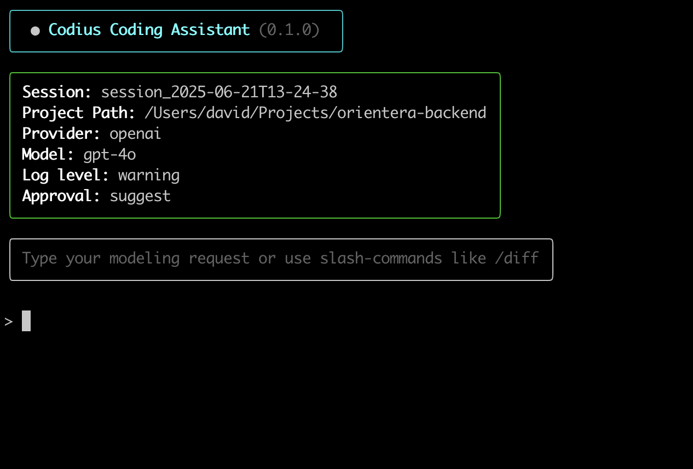

<h1 align="center">Codius CLI</h1>
<p align="center">
    Coding assistant for domain-driven design projects in ASP.NET Core.
</p>

<p align="center"><code>pip install codius</code></p>

<p align="center">
  
</p>


---

## Why Codius?

`Codius` is under active development with one clear goal:

> Free domain-driven designers from boilerplate and let them focus on modeling.

Instead of writing out every aggregate, method, and repository by hand, you describe what you want to build — and Codius helps generate the code that matches your intent, aligned with the [OpenDDD.NET](https://www.openddd.net) framework.

It doesn’t try to replace your thinking — it amplifies it.  
You stay in control of the model. Codius handles the scaffolding and code generation.

If you’re passionate about DDD, code quality, and improving developer flow, try Codius — or help shape it by contributing to its development.

---

## Quickstart

```bash
$ pip install codius    # Temporary package name
$ cd /your/project/root # Go to your project's root
$ codius                # Starts Codius CLI
```

On first run, Codius will create `.openddd/config.yaml` and initialize a modeling session.

---

## Slash Commands

| Command         | Description |
|----------------|-------------|
| `/clear`        | Reset session state and history |
| `/clearhistory` | Reset session history |
| `/compact`      | Summarize and condense history |
| `/model`        | Change LLM provider/model |
| `/approval`     | Switch approval mode (suggest/auto) |
| `/sessions`     | List previous sessions |
| `/history`      | Show session history |

---

## Requirements

- Python 3.11+
- A project built with [OpenDDD.NET](https://github.com/runemalm/OpenDDD.NET)
- OpenAI or Anthropic API key (set in `config.yaml` or use `/model` in the CLI)
- **Experience with Domain-Driven Design** — Codius assumes you're comfortable working with aggregates, value objects, repositories, and other core DDD patterns

---

## Contribute

Codius is **under active development**.

If you're into:
- Domain-Driven Design
- Developer tooling
- LLM-based assistants
- Improving the modeling experience

...then jump in! Try it out, explore the codebase, and open an issue or PR.

---

## License

Licensed under [GPLv3](https://www.gnu.org/licenses/gpl-3.0.html).
