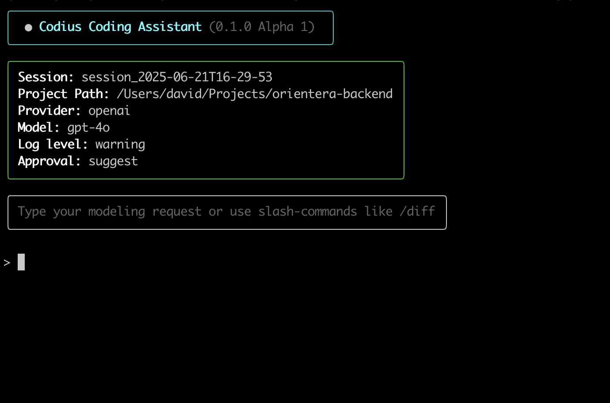

<h1 align="center">Codius CLI</h1>
<p align="center">
    Coding assistant for domain-driven design projects in ASP.NET Core.
</p>

<p align="center"><code>pip install codius</code></p>

<p align="center">
  
</p>


---

> ⚠️ **Alpha Release**
>
> Codius is currently in alpha.  
> Features may be incomplete, unstable, or subject to change.  
> Use with care in production environments — and help shape it by providing feedback or contributing!

---

## Why Codius?

> Free domain-driven designers from boilerplate and let them focus on modeling.


Codius is your coding assistant for domain-driven design — built to take care of the repetitive tasks that just have to get done.

Instead of manually writing boilerplate for aggregates, methods, repositories, and other building blocks, you describe the changes you want to make. Codius takes care of translating those changes into code, aligned with the [OpenDDD.NET](https://www.openddd.net) framework.

This frees you up to focus on what really matters: modeling your domain and evolving your design.  
Refinements become faster, iteration cycles shorter, and the feedback loop tighter.

With Codius, your ideas move from thought to implementation without getting lost in scaffolding.

If you’re passionate about DDD, code quality, and improving developer flow, try Codius — or help shape it by contributing to its development.

---

## Example

Say you want a `Book` aggregate with `Title`, `Author`, and `Price`, and a method to apply discounts.

Just tell Codius:

```
> Create a Book aggregate with Title, Author, and Price.  
Add a method to apply a discount to the Price.
```

Codius handles the boilerplate — aggregate, method, repository — so you can focus on the model.

---

## Quickstart

```bash
$ pip install codius    # Temporary package name
$ cd /your/project/root # Go to your project's root
$ codius                # Starts Codius CLI
```

On first run, Codius will create `.codius/config.yaml` and initialize a modeling session.

---

## Compatibility

Codius is designed for projects built with [OpenDDD.NET](https://www.openddd.net) — an opinionated framework for Domain-Driven Design in .NET.

It works directly on your existing codebase, generating and modifying code according to OpenDDD.NET’s conventions.  
Whether you’re evolving your domain model or adding new building blocks, Codius helps you stay consistent and productive within the framework’s structure.

---

## Slash Commands

| Command         | Description |
|----------------|-------------|
| `/clear`        | Reset session state and history |
| `/clearhistory` | Reset session history |
| `/compact`      | Summarize and condense history |
| `/model`        | Change LLM provider/model |
| `/approval`     | Switch approval mode (suggest/auto) |
| `/sessions`     | List previous sessions |
| `/history`      | Show session history |

---

## Requirements

- Python 3.11+
- A project built with [OpenDDD.NET](https://www.openddd.net)
- OpenAI or Anthropic API key (set in `config.yaml` or use `/model` in the CLI)
- **Experience with Domain-Driven Design** — Codius assumes you're comfortable working with aggregates, value objects, repositories, and other core DDD patterns

---

## Contribute

Codius is **under active development**.

If you're into:
- Domain-Driven Design
- Developer tooling
- LLM-based assistants
- Improving the modeling experience

...then jump in! Try it out, explore the codebase, and open an issue or PR.

---

## License

Licensed under [GPLv3](https://www.gnu.org/licenses/gpl-3.0.html).
